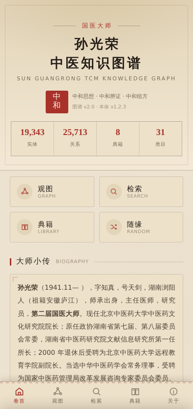
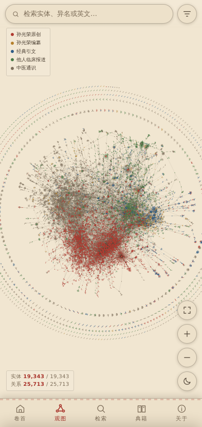
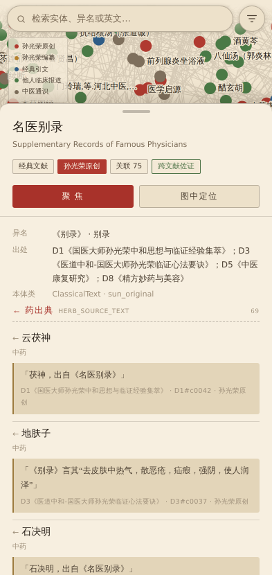
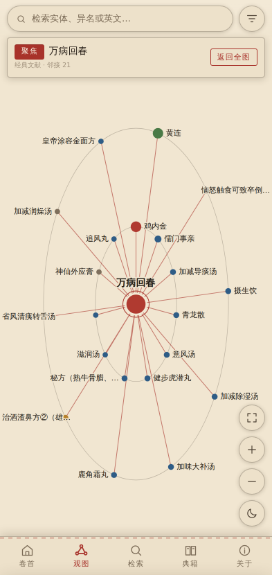
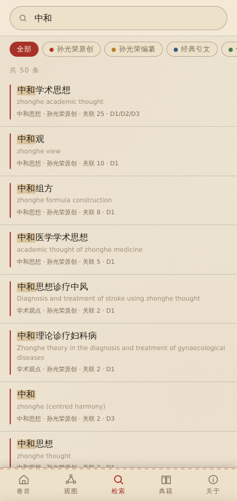
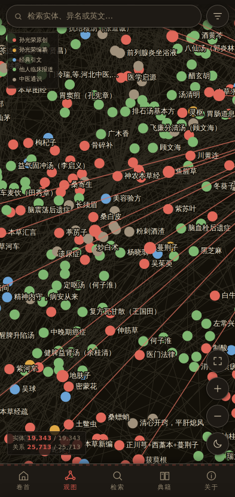

# 国医大师孙光荣中医知识图谱 · Android

> **Sun Guangrong TCM Knowledge Graph — Android App**
> 研发：**孙光荣大师弟子田建辉团队** 联合 **医哲未来人工智能研究院（IMPF-AI Institute）**

把原本只能在桌面浏览器里打开的 `sunguangrong_kg_v2_explorer.html`（7 MB 单文件），
重制为一款**国风、离线、可签名安装**的 Android 应用。

| | | |
|:--:|:--:|:--:|
|  |  |  |
| 卷首 · 大师小传与总览 | 观图 · 19,343 实体星图 | 详情 · 关系与原文佐证 |
|  |  |  |
| 聚焦 · 自我中心网络 | 检索 · 中英文与异名 | 夜读配色 |

---

## 一、安装包

```
android/out/SunGuangrong-TCM-KnowledgeGraph-v1.0.0.apk
```

| 项目 | 值 |
|---|---|
| 应用名 | 孙光荣中医知识图谱 |
| 包名 | `cn.impfai.sgrkg` |
| 版本 | 1.0.0（versionCode 1） |
| 体积 | 1.42 MB |
| 系统要求 | Android 5.0（API 21）及以上，targetSdk 34 |
| 签名 | 自带 4096 位 RSA 密钥，v1 + v2 + v3 三重签名 |
| 数据 | 全部内置，**首次打开即可离线使用**，不上传任何数据 |

**安装方法**：把 APK 传到手机 → 允许「安装未知来源应用」→ 点击安装。

> 应用声明了 `INTERNET` 权限，这是 WebView 以 `https://appassets.androidplatform.net`
> 虚拟域名装载 APK 内置资源所必需的。所有非本地请求在
> `MainActivity.serve()` 中被直接返回 403，应用不会访问任何外部服务器。

---

## 二、应用做了什么

### 1. 国风视觉
- **宣纸 / 夜读**双配色，右下角月牙一键切换，选择会被记住，并同步系统状态栏配色。
- 宣纸底纹、朱砂印章「中和」、回纹角饰、竖排卷首、宋体为主的排版。
- 五类知识来源用五种传统色区分：
  朱砂（孙光荣原创）· 藤黄（孙光荣编纂）· 靛青（经典引文）· 竹青（他人临床报道）· 墨灰（中医通识）。

### 2. 五个页面
| 页面 | 内容 |
|---|---|
| **卷首** | 大师小传、数据总览、知识来源分布、四个快捷入口（观图 / 检索 / 典籍 / 随缘）、研发团队 |
| **观图** | 19,343 实体 × 25,713 关系的可平移缩放星图 |
| **检索** | 中文 / English / 异名全文检索，可按来源或实体类型（31 类）过滤 |
| **典籍** | 八部文献（点击可单看某一部）、31 类实体、44 类关系本体 |
| **关于** | 研发团队、图谱说明、抽样审校精度、使用提示、免责声明 |

### 3. 图谱交互
- 单指拖动平移，双指捏合缩放，**双击**快速放大。
- 轻点节点弹出详情抽屉：中英文名、异名、出处、按关系类型分组的全部邻接关系，
  每条关系附**原文佐证**与**出处编号**（如 `D3#c0037`），点原文中的实体即可跳转，抽屉内可「返回」。
- **聚焦模式**：把某个节点及其邻居单独铺成同心椭圆环并显示全部标签 —— 这是 19,343 个
  节点在手机上真正「读得动」的关键。逐层点下去即可顺着学术脉络探索。
- **筛选**：按知识来源 / 文献 / 实体类型任意组合，实时更新可见实体与关系计数。
- 未通过本体 domain/range 校验的关系标注 **⚑ 待审**，不作定论。

### 4. 性能
原版把 7 MB 数据直接内联在 HTML 里，并在**每次打开时**在浏览器里跑 190 轮力导向迭代。
本版把这些工作全部搬到了构建期：

- 离线用 **ForceAtlas2 + Barnes-Hut 四叉树**重算布局（`tools/layout.mjs`），
  坐标烘焙进 `graph.json`，App 启动只需解析 JSON，**不做任何物理迭代**。
- 数据进内存后转为 `Float32Array` / `Int32Array` 与 CSR 邻接表。
- 均匀网格做视口裁剪与指尖命中测试。
- 平移缩放时用预渲染位图代理，停手后再矢量精绘；标签用屏幕像素占位网格去重叠。

实测整图矢量重绘约 **2 ms**（19,343 节点 / 25,713 条边，桌面 Chromium 基准）。

---

## 三、布局是怎么算的

`tools/layout.mjs` 的思路：

1. **剥叶**：19,343 个节点里有 10,740 个是度为 1 的叶子。先把它们摘掉，
   只对 8,603 个核心节点跑力导向，最后再把叶子以「花瓣」形式挂回锚点。
2. **分量各自布局**：核心图有 1,004 个连通分量（最大的 7,175 个节点）。
   每个分量单独跑 ForceAtlas2，斥力用 Barnes-Hut 四叉树近似。
3. **收尖刺**：主分量用 strongGravity，再对 92 分位以外的节点做幂次径向压缩，
   把长链条甩出去的「触须」收回来，中心密集区完全不动。
4. **装箱**：主分量居中，其余 1,003 个小分量按实际包围圆半径排进同心环 ——
   于是外圈自然形成了几道由孤岛组成的环带。

---

## 四、自行构建

```bash
# 依赖：JDK 17+、Node 18+、Android SDK（build-tools 35.0.0+、platforms/android-34）
npm  --version && java -version

# 1) 从原始 HTML 抽出数据并重算布局（只在数据更新时需要）
python3 - <<'PY'
import json
src = open('sunguangrong_kg_v2_explorer.html', encoding='utf-8').read()
i = src.index('const DATA = '); j = src.index('\nconst RC =')
d = json.loads(src[i+len('const DATA = '):j].rstrip().rstrip(';'))
import os; os.makedirs('tools/build', exist_ok=True)
json.dump(d, open('tools/build/raw.json','w',encoding='utf-8'), ensure_ascii=False, separators=(',',':'))
PY
node tools/layout.mjs

# 2) 打包并签名
ANDROID_HOME=/path/to/android-sdk android/build.sh
```

`android/build.sh` 直接调用 SDK 自带的 `aapt2` / `d8` / `zipalign` / `apksigner`，
**不依赖 Gradle，也不下载任何第三方库**，离线可复现。

> ⚠️ **build-tools 必须 35.0.0 或更高**。34.0.0 附带的 d8（R8 8.2.2）无法处理
> JDK 21 javac 产生的匿名内部类，会以 `NullPointerException` 崩溃。

调试网页层（无需安卓设备）：

```bash
node tools/shoot.mjs     # 按手机视口逐屏截图并检查 JS 报错
```

---

## 五、签名密钥

首次构建会在 `android/keystore/sgr-kg-release.jks` 自动生成一把 4096 位 RSA 密钥并复用，
以保证后续版本能覆盖安装。

```
证书 DN     CN=Sun Guangrong TCM Knowledge Graph, OU=IMPF-AI Institute,
            O=Tian Jianhui Team x IMPF-AI Institute, L=Shanghai, C=CN
SHA-256     24:0C:CB:B1:20:66:66:90:E4:B3:BC:FF:CC:B1:58:68:C8:A9:E0:4A:2A:42:61:11:52:01:1E:D2:BB:93:18:02
有效期      30 年
```

> **注意**：该密钥与口令（`sgrkg2024`）随仓库一同提交，仅适用于内部分发。
> 若要上架应用商店，请改用自行保管的密钥：
> ```bash
> KEYSTORE=/secure/path/my.jks KS_PASS=**** KEY_ALIAS=**** android/build.sh
> ```
> 密钥一旦更换，已安装的旧版本必须先卸载。

---

## 六、目录结构

```
sunguangrong_kg_v2_explorer.html      原始桌面版（保留，作为数据源）
tools/
  layout.mjs                          离线布局预计算（ForceAtlas2 + Barnes-Hut）
  shoot.mjs                           无头浏览器逐屏截图 / 报错检查
  icons.mjs                           生成传统 PNG 启动图标
android/
  build.sh                            打包 + 签名（无 Gradle）
  keystore/sgr-kg-release.jks         发布密钥
  out/*.apk                           产物
  app/src/main/
    AndroidManifest.xml
    java/cn/impfai/sgrkg/MainActivity.java   WebView 宿主 + assets 拦截 + 返回键
    res/                              图标、启动图、主题
    assets/web/                       离线 Web 应用
      index.html  css/app.css  js/app.js
      data/graph.json                 已烘焙坐标的图谱数据（6.7 MB）
```

---

## 七、免责声明

本应用为中医药学术研究与教学参考工具，所载内容由文献自动抽取并经抽样审校
（v2 抽样严格精度 81.7%，n=60；v1 84.9%，n=119），**不能替代执业医师的诊断与处方**。
请勿据此自行用药。方药之用，须辨证论治、因人制宜。

---

<div align="center">

**孙光荣大师弟子田建辉团队** × **医哲未来人工智能研究院（IMPF-AI Institute）**

承国医之道 · 启智能之钥

</div>
